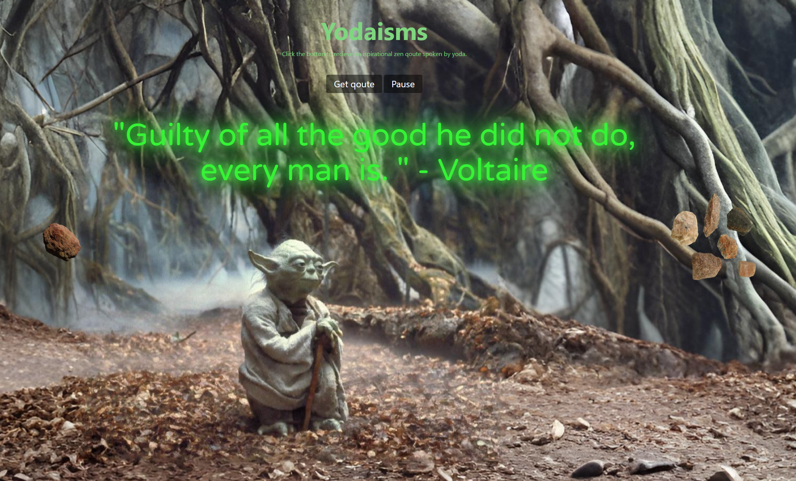
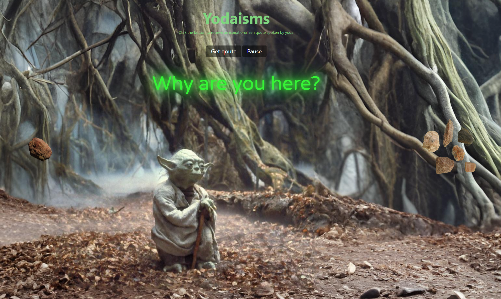

# Yodaisms

Yodaisms is a whimsical frontend web app that transforms profound Zen quotes into the iconic speech patterns of Master Yoda. Combining spiritual wisdom with quirky grammar, ambient audio, and subtle animation, this project offers a playful and immersive experience inspired by the Star Wars universe.

**Live Site:** [https://yodaisms.netlify.app](https://yodaisms.netlify.app)

## Tech Stack

- HTML, CSS, JavaScript
- Zen Quotes API (via realinspire.live)
- FunTranslations Yoda API
- Custom audio playback and DOM-based animations

## Features

- Fetches a random Zen quote from a remote API
- Translates the quote into Yoda-speak using the FunTranslations API
- Adds randomized Yoda-like phrases (e.g., “hmmm,” “yesss”) to enhance authenticity
- Plays "Yoda and the Force" theme music on page load
- Animates floating rocks around Yoda to simulate his use of the Force
- Fully frontend-based; no server or backend required

## Lessons Learned

- Integrated and managed multiple external APIs asynchronously
- Built custom logic to simulate natural speech modifications
- Coordinated animations and timed effects using JavaScript and CSS
- Enhanced user experience through a blend of audio, visuals, and humor

## Installation

1. Clone the repository  
   `git clone https://github.com/yourusername/yodaisms.git`

2. Navigate to the project directory  
   `cd yodaisms`

3. Open the `index.html` file in your browser  
   *(No server setup required)*

## Screenshots

## Future Improvements

- Add toggle to switch between Yoda-speak and standard Zen quote
- Improve animation fluidity with GSAP or WebGL
- Add volume controls or mute toggle for audio
- Build additional Star Wars-themed interactions or Easter eggs

---